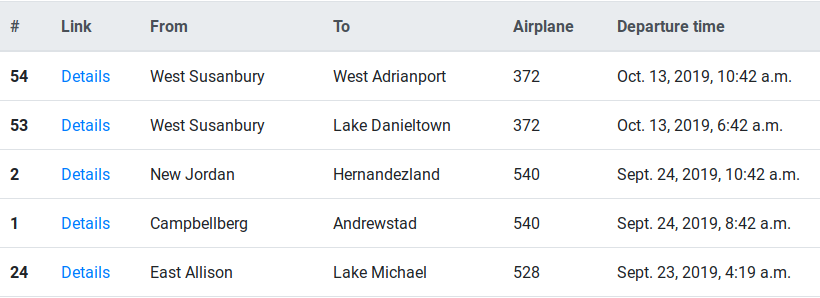
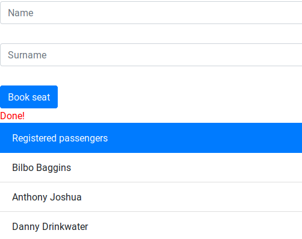
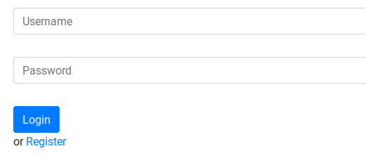

# Airlines system
## Overview
This is application created to manage crews and aircrafts.
Aftered logging in you can assign crew to a given flight or create a new crew.
You can also add new passengers to flights. Anonumous guests can see all the information,
but can't add or change any of them.
## Running and testing
### Running app
To run, all you have to do is:
```bash
pip3 install -r requirements.txt
python3 manage.py runserver
```
and head to localhost:8000
### Testing
To test write:
```bash
#geckodriver file has to be in path
export PATH=$PATH:<path to this project>
python3 manage.py test
```
Program will run few tests on API and 2 Selenium tests 
(one trying to assign busy crew to a flight, 
and second one assigning available crew to a flight).
## Examples
|  |
| :--: |
| *Flights list* |
|  |
| *Passengers list* |
|  |
| *Login view* |